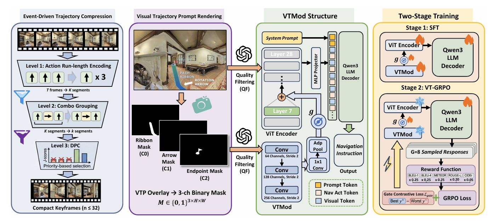

# [ACMMM 2026] VTInstructor: Visual Trajectory Prompting for Navigation Instruction Generation in Continuous Environments

<p align="center">
  <a href="https://arxiv.org/abs/2608.15284"></a>
  <a href="https://huggingface.co/TidalYang/VTInstructor-8b"></a>
  
</p>

<p align="center">
  
</p>

## Introduction

This repository provides the full open-source pipeline for **VTInstructor**: generating natural-language navigation instructions for trajectories in continuous environments (e.g. R2R-CE, RxR-CE).

It covers:

- **Rendering** Habitat egocentric panoramas along VLN-CE trajectories
- **Instruction filtering** (optional; a keep-list for SFT / GRPO is shipped)
- **Visual Trajectory Prompt (VTP)** overlays and 3-channel semantic masks (ribbon / arrow / endpoint)
- **VP-Adapter SFT** on Qwen3-VL-8B-Instruct
- **VP-GRPO** gate-only RL refinement
- **Evaluation**: inference writes `prediction` + `references`; `metrics/evaluate.py` scores BLEU / CIDEr / METEOR / ROUGE-L / SPICE
- **Inference for data augmentation**, with VTP rendering optional

```
Stage 1  Preprocess     →  Habitat panoramas  +  optional instruction filter
Stage 2  VP masks       →  overlay frames + 3-channel semantic masks
Stage 3  VP-Adapter SFT →  supervised fine-tuning
Stage 4  VP-GRPO        →  RL refinement (gate-only)
Eval     infer + score  →  eval/infer.py → metrics/evaluate.py
Stage 5  Generation     →  instructions for data augmentation (VTP optional)
```

## Contribution

- **The first VLN instruction generation framework for continuous environments.** VTInstructor generates instructions from ego-centric RGB trajectories paired with action sequences; the model itself receives only RGB frames as visual input, without navigation graphs, pre-built maps, or scene reconstruction.
- **A visual trajectory prompting framework for explicit spatial grounding.** We convert implicit trajectory geometry in dense RGB streams into explicit spatial cues through EDTC for navigation-critical keyframe selection, VTP for path/turn/goal prompting on these anchors, VTMod for trajectory-aware visual encoding, and VT-GRPO for reward-driven calibration of spatial signal injection.
- **State-of-the-art performance with practical utility.** VTInstructor achieves state-of-the-art results on the R2R-CE and RxR-CE Val Unseen benchmarks, surpassing the strongest baseline by +0.109 and +0.357 CIDEr, respectively, improving frozen-follower success by 14.7 percentage points, and delivering +3 SR-point data augmentation gains on both benchmarks.
- **Fully open-sourced codebase.** All code for rendering, VTP construction, VP-Adapter SFT, VP-GRPO, and evaluation is released in this repository, only DPC in EDTC section is not available yet.

## Repository layout

```
VTInstructor/
├── preprocess/                 # Habitat rendering + optional instruction filter
│   ├── rendering/              # ★ Stage 1a: R2R-CE / RxR-CE keyframes
│   └── filtering/              # ★ Stage 1b: score + keep-list (ships r2rce_train_filtered.json)
├── visual_prompt/              # ★ Stage 2: VTP overlay + 3-channel masks
│   └── render_masks.py
├── vtmod/                      # VTMod: encoder / adapter / wrapper / VP dataset
│   ├── config.py
│   ├── encoder.py
│   ├── adapter.py
│   ├── wrapper.py              # also exports generate_with_vp (shared by eval + generate)
│   ├── dataset.py
│   └── test_modules.py
├── train/                      # Stage 3 SFT + Stage 4 VP-GRPO
│   ├── sft.py                  # ★ Stage 3 entry
│   ├── run_sft.sh
│   ├── grpo.py                 # ★ Stage 4 entry
│   ├── run_grpo.sh
│   ├── reward.py
│   └── ds_zero2.json
├── eval/                       # Benchmark inference (then score with metrics/)
│   ├── infer.py                # writes prediction + references JSON
│   └── run_eval.sh             # infer → metrics/evaluate.py
├── generate/                   # Data augmentation only (not scored), useful when you want to generate training data for downstream VLN agents.
│   ├── generate_instructions.py
│   └── run_generate.sh
├── common/                     # Shared prompts, action grouping, panorama dataset
│   └── dataset.py
├── metrics/                    # NLG scoring only — no inference
│   ├── evaluate.py
│   ├── pred_example.json       # input schema for evaluate.py
│   └── R2R_val_unseen.json     # 613 traj × 3 human refs, ground truth for R2RCE valunseen scoring
├── environment/                # Exact SFT / GRPO pip freezes
├── ENVIRONMENT.md              # Two-env setup; DeepSpeed 0.14.4 pin
├── run_pipeline.sh             # Optional: run stages 1–4 in order
└── requirements.txt
```

**Shipped artifacts** (non-deterministic if regenerated):

| File | Role |
|------|------|
| `preprocess/filtering/r2rce_train_filtered.json` | R2R-CE train keep-list for SFT / GRPO |
| `metrics/R2R_val_unseen.json` | Eval multi-references |
| `metrics/pred_example.json` | Example input for `metrics/evaluate.py` |

Checkpoints are not in git; point `SFT_CKPT` / `EVAL_CKPT` at your local weights.

## Pipeline

### Prerequisites

| Resource | Download & why it is required |
|----------|-------------------------------|
| Matterport3D scenes | [Matterport3D](https://niessner.github.io/Matterport/) (`.glb` + `.navmesh`). Habitat replays VLN-CE trajectories in these meshes when rendering panoramas (`preprocess/rendering`) and when painting VTP overlays / masks (`visual_prompt`). |
| habitat-sim | [facebookresearch/habitat-sim](https://github.com/facebookresearch/habitat-sim). The simulator that steps through each episode and dumps egocentric RGB (and, for VTP, pose + depth). Needed only for data preparation, not for training or inference from already-rendered splits. |
| Qwen3-VL-8B-Instruct | [Qwen/Qwen3-VL-8B-Instruct](https://huggingface.co/Qwen/Qwen3-VL-8B-Instruct). Backbone for SFT, VP-GRPO, evaluation, and instruction generation. Keep a local snapshot and point `MODEL_DIR` at it. Released weights: [TidalYang/VTInstructor-8b](https://huggingface.co/TidalYang/VTInstructor-8b). |
| pycocoevalcap + JRE | [salaniz/pycocoevalcap](https://github.com/salaniz/pycocoevalcap) and a Java runtime. BLEU / METEOR / ROUGE-L / CIDEr / SPICE for GRPO rewards (`train/reward.py`) and for official scoring (`metrics/evaluate.py`). We follow the same scoring protocols from C-Instructor[https://www.ecva.net/papers/eccv_2024/papers_ECCV/papers/04155.pdf], sadly all other works are not opensourced.|
| Python environments | Freeze files in [`environment/`](environment/) and setup notes in [`ENVIRONMENT.md`](ENVIRONMENT.md). SFT and GRPO use **separate** envs; GRPO requires DeepSpeed **0.14.4** exactly. |

Before the first run you can check the VP-Adapter wiring — encoder shapes, adapter registration, save/load round-trip, and gate gradient flow — against your local backbone:

```bash
MODEL_DIR=/path/to/Qwen3-VL-8B-Instruct python vtmod/test_modules.py
```

If Habitat fails with a CUDA/EGL device error:

```bash
export __EGL_VENDOR_LIBRARY_FILENAMES=/usr/share/glvnd/egl_vendor.d/10_nvidia.json
```

### 1. Preprocess — rendering and (optional) filtering

Rendering and filtering are independent. Rendering writes RGB keyframes. Filtering scores R2R-CE train instructions and writes a keep-list that SFT / GRPO read.

#### Rendering — clean images

```bash
# R2R-CE (paper defaults: 256×384 faces → 768×384 image, camera_height=0.75)
python preprocess/rendering/render_r2rce.py \
  --train_json /path/to/R2R_VLNCE_v1-3/train/train.json.gz \
  --scenes_root /path/to/scenes_root \
  --output_dir data/R2RCE_visual/r2rce_train_visual \
  --log_path logs/r2rce_train_base.log \
  --max_episodes 0 \
  --sample_mode event --frame_stride 2 \
  --width 256 --height 384 --camera_height 0.75 \
  --max_parts 5 \
  --panorama --panorama_hfov 90.0 --panorama_step 90.0

# RxR-CE
python preprocess/rendering/render_rxrce.py \
  --train_json /path/to/RxR_VLNCE_v0/train/train_guide.json.gz \
  --scenes_root /path/to/scenes_root \
  --output_dir data/RXRCE_visual/rxrce_train_visual \
  --log_path logs/rxrce_train_base.log \
  --width 256 --height 384 --camera_height 0.75 \
  --panorama --panorama_hfov 90.0 --panorama_step 90.0
```

`preprocess/rendering/run_render_r2rce.sh` and `run_render_rxrce.sh` wrap the two commands above with the paper geometry and render both `train` and `val_unseen` into the four canonical directories used by every later stage. Set `DATASET_ROOT` (or `TRAIN_JSON` / `VAL_UNSEEN_JSON` / `SCENES_ROOT`) to point them at your data.

#### Filtering — optional keep-list for R2R-CE train

To keep reproduction stable, we ship both the paper keep-list (`preprocess/filtering/r2rce_train_filtered.json`, score ≥ 6) and our filtering script. You do not need to rerun the filter to match the paper; SFT / GRPO already default to that JSON. If you want a different scorer or threshold, edit the scripts under `preprocess/filtering/` and run:

```bash
# needs a DashScope / Qwen API key
bash preprocess/filtering/run_filter.sh
```

### 2. VTP overlays and masks

Stage 1 writes **clean** RGB panoramas. Stage 2 walks the same trajectories again, paints ribbon / turn / goal onto those frames, and writes a 3-channel binary mask (`C0=ribbon, C1=arrow, C2=endpoint`) that the VP-Adapter reads. It edits each `episode_*` directory in place.

Run it on **all four** splits, `val_unseen` included: the VP-Adapter consumes `vp_masks` at inference exactly as it does during training. Our testing confirms that training with VTP rendering teaches the VTInstructor model to understand spatial relationships. As a result, the model retains strong spatial skills during inference, even without any VTP overlays.

```bash
for split in \
  data/R2RCE_visual/r2rce_train_visual \
  data/R2RCE_visual/r2rce_valunseen_visual \
  data/RXRCE_visual/rxrce_train_visual \
  data/RXRCE_visual/rxrce_valunseen_visual
do
  python visual_prompt/render_masks.py \
    --data_dir "$split" \
    --scenes_root /path/to/scenes_root \
    --width 256 --height 384 --camera_height 0.75 \
    --hfov 90.0 --panorama_step 90.0
done
```

If masks are missing the code falls back to all-zero masks and prints a `[VP]` line naming the split. During **training** that is a `WARN` and almost certainly means Stage 2 was skipped. During **evaluation or inference** it is an `INFO`: running without visual trajectory prompting is a supported mode, it just measures the no-VTP setting. `EVAL_ZERO_VP=1` requests that ablation explicitly.

For data augmentation this stage is optional — see [Inference for data augmentation](#6-inference-for-data-augmentation).

To run stages 1–4 in one go: `bash run_pipeline.sh`.

### 3. VP-Adapter SFT

```bash
export MODEL_DIR=/path/to/Qwen3-VL-8B-Instruct
export R2RCE_TRAIN_DATA_DIR=data/R2RCE_visual/r2rce_train_visual
export RXRCE_TRAIN_DATA_DIR=data/RXRCE_visual/rxrce_train_visual
bash train/run_sft.sh
```

Train data paths already default to the layout Stage 1 produces. Uses `torch.distributed.run` (HF Trainer + DDP); `FILTERED_JSON` defaults to the shipped keep-list.

This script **trains only**. Scoring is the next section.

### 4. VP-GRPO

```bash
export MODEL_DIR=/path/to/Qwen3-VL-8B-Instruct
export SFT_CKPT=/path/to/outputs/nig_vp_adapter_v3.1_sft/checkpoint-NNNN
bash train/run_grpo.sh
```

`R2R_TRAIN_JSON` is optional; without it, GRPO aggregates multi-refs by `trajectory_id`.

### 5. Evaluation (infer → score)

`eval/infer.py` writes a JSON list of `{prediction, references, ...}` (same schema as `metrics/pred_example.json`). `eval/run_eval.sh` then calls `metrics/evaluate.py` on that file. Extra keys such as `trajectory_id` are ignored by the scorer.

```bash
export MODEL_DIR=/path/to/Qwen3-VL-8B-Instruct
export R2RCE_EVAL_DATA_DIR=data/R2RCE_visual/r2rce_valunseen_visual
export RXRCE_EVAL_DATA_DIR=data/RXRCE_visual/rxrce_valunseen_visual
EVAL_CKPT=/path/to/checkpoint bash eval/run_eval.sh
```

`R2R_VAL_UNSEEN_JSON` defaults to the shipped `metrics/R2R_val_unseen.json`. To score an existing pred JSON without re-running inference:

```bash
python metrics/evaluate.py \
  --pred_json outputs/eval/eval_r2rce_valunseen_YYYYMMDD_HHMMSS.json \
  --out_json  outputs/eval/eval_r2rce_valunseen_YYYYMMDD_HHMMSS_metrics.json \
  --print_ref_stats
```

### 6. Inference for data augmentation

If you want to use VTInstructor for data augmentation, **VTP rendering is optional**. The model supports instruction generation from RGB renders alone, because the VTP contextual information is already learned into the weights during training. Supplying VTP renders (Stage 2) still gives more accurate instructions, so use them when you can.

Generation runs on any directory of rendered trajectories in the Stage-1 layout (`episode_*/sample.json`), and `DATASET_TYPE` picks the output style: `r2rce` for R2R-style instructions (25–40 words, 2–3 landmarks), `rxrce` for RxR-style narration (35–60 words, richer spatial detail).

```bash
# R2R-style instructions for a rendered split
CKPT=/path/to/checkpoint \
MODEL_DIR=/path/to/Qwen3-VL-8B-Instruct \
DATA_DIR=/path/to/rendered_split \
DATASET_TYPE=r2rce \
OUT_JSON=outputs/augment/r2r_style.json \
GEN_CUDA=0,1,2,3 \
  bash generate/run_generate.sh

# RxR-style narration for the same trajectories
DATASET_TYPE=rxrce OUT_JSON=outputs/augment/rxr_style.json \
CKPT=... MODEL_DIR=... DATA_DIR=... \
  bash generate/run_generate.sh
```

`VP_MODE=auto` (the default) uses `vp_masks` when the split has them and drops to the RGB-only path when it does not, so one command covers both. Other useful knobs: `GRANULARITY` (`trajectory` or `episode`), `TEMPERATURE` (raise to ~1.0 for diverse augmentations), `GEN_CUDA` (multi-GPU, shards merged automatically).

Output is a records JSON with `generated_instruction`, `trajectory_id`, `episode_ids` and `scene_id`. That schema is **not** the input to `metrics/evaluate.py` (which needs `prediction` + `references`); use `eval/run_eval.sh` for paper scores. To get a split a VLN-CE dataloader can load directly, give the original `.json.gz` as a template — episode geometry is cloned and only the instruction text is replaced:

```bash
CKPT=... DATA_DIR=... \
VLNCE_TEMPLATE=/path/to/R2R_VLNCE_v1-3/train/train.json.gz \
OUT_VLNCE_GZ=outputs/augment/train_generated.json.gz \
  bash generate/run_generate.sh
```

Stale `instruction_tokens` are dropped from the emitted split, so re-tokenise with your follower's vocabulary.

## Citation

If you use this repository or the released model, please cite:

```bibtex
@misc{yang2026vtinstructorvisualtrajectoryprompting,
      title={VTInstructor: Visual Trajectory Prompting for Navigation Instruction Generation in Continuous Environments},
      author={Haolin Yang and Yuxing Long and Zihan Yang and Hao Dong},
      year={2026},
      eprint={2608.15284},
      archivePrefix={arXiv},
      primaryClass={cs.RO},
      url={https://arxiv.org/abs/2608.15284},
}
```
